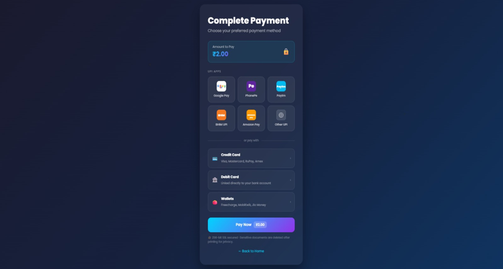
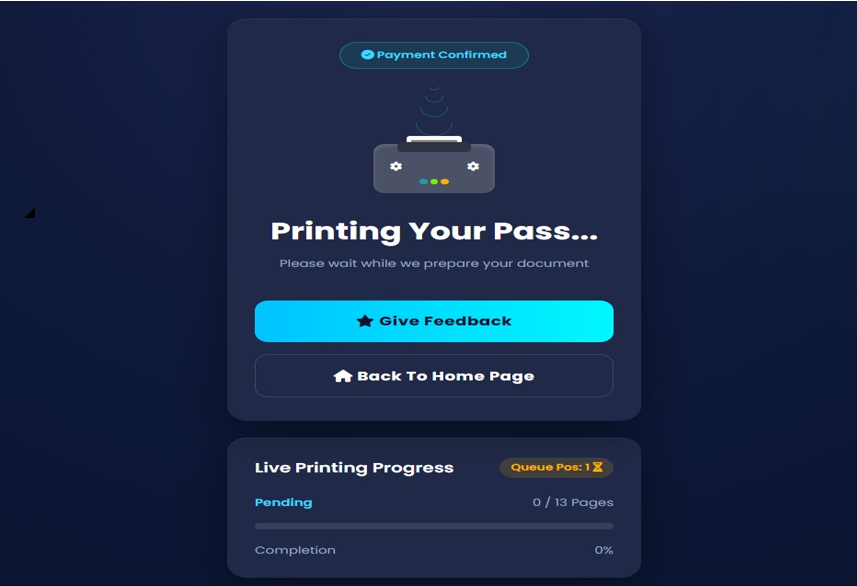
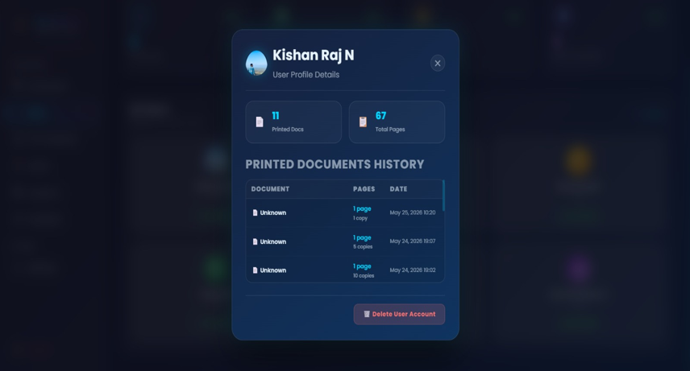

# 🖨️ QR Code Based Smart Printing System

> A secure and intelligent web-based printing management system developed using **Flask, Python, MongoDB, HTML, CSS, and JavaScript**.


\## 📌 Project Overview


The QR Code Based Smart Printing System is designed to simplify and automate the printing process in educational institutions and office environments. Users can upload documents, submit print requests, monitor printing status, and provide feedback, while administrators can manage users, approve print requests, assign printers, and monitor system activities.


A QR code is generated for quick access to the application, enabling users to conveniently open the login page by scanning it.


\---


\## ✨ Features


\### 👤 User Module

\- User Registration

\- Secure Login

\- OTP Verification

\- Forgot Password

\- User Dashboard

\- Profile Management

\- Document Upload

\- Print Request Submission

\- Print Queue Tracking

\- Printing Status Monitoring

\- Feedback Submission


\### 👨‍💼 Admin Module

\- Admin Login

\- Dashboard Analytics

\- View Registered Users

\- Manage Print Requests

\- Approve / Reject Requests

\- Assign Available Printers

\- Monitor Print Queue

\- Manage Feedback


\### 🖨️ Printing Module

\- Physical Printer Integration

\- Automatic Printer Assignment

\- Print Queue Management

\- Real-Time Print Status

\- Waiting Page

\- Printing Progress Monitoring


\### 🔒 Security Features

\- OTP-Based Authentication

\- Password Encryption

\- Session Management

\- Secure MongoDB Storage


\---


\## 🛠️ Technology Stack


| Technology | Purpose |

|------------|---------|

| Python | Backend Development |

| Flask | Web Framework |

| MongoDB | Database |

| HTML5 | Structure |

| CSS3 | Styling |

| JavaScript | Client-side Functionality |

| PyMongo | MongoDB Connectivity |

| PyWin32 | Windows Printer Integration |

| SumatraPDF | Silent PDF Printing |

| QRCode Library | QR Code Generation |

| Bootstrap | Responsive UI |


\---


\## 📂 Project Structure


```text

QR-Code-Based-Smart-Printing-System/

│

├── app.py

├── requirements.txt

├── README.md

├── LICENSE

├── .gitignore

│

├── static/

│   ├── css/

│   ├── images/

│   ├── video/

│   └── uploads/

│

└── templates/

&#x20;   ├── adminlogin.html

&#x20;   ├── adminpannel.html

&#x20;   ├── dashboard.html

&#x20;   ├── feedback.html

&#x20;   ├── forgotpassword.html

&#x20;   ├── payment.html

&#x20;   ├── waiting.html

&#x20;   └── ...

```


\---


\## ⚙️ Installation


\### Clone the Repository


```bash

git clone https://github.com/KishanRajn007/QR-Code-Based-Smart-Printing-System.git

```


Move into the project directory:


```bash

cd QR-Code-Based-Smart-Printing-System

```


Install dependencies:


```bash

pip install -r requirements.txt

```


Configure your `.env` file with:


\- MongoDB Connection URI

\- Email Credentials

\- Secret Key


Run the application:


```bash

python app.py

```


Open your browser and visit:


```

http://127.0.0.1:5000

```


\---


\## 🔄 System Workflow


1\. User scans the QR Code.

2\. Login page opens.

3\. User logs in using OTP authentication.

4\. User uploads a document.

5\. Print request is submitted.

6\. Administrator reviews the request.

7\. Administrator assigns an available printer.

8\. The document is sent to the assigned printer.

9\. User can monitor the print status.

10\. User submits feedback after printing.


\---


\## 📸 Screenshots


## 📸 Project Screenshots

The following screenshots demonstrate the core functionalities of the **QR Code Based Smart Printing System**.

| Login Page | Admin Login |
|------------|-------------|
|  |  |

| Admin Dashboard | User Dashboard |
|-----------------|----------------|
|  |  |

| Upload Document | Payment |
|-----------------|---------|
|  |  |

| Print Requests | Waiting Page |
|----------------|--------------|
|  |  |

| User Analytics | User Feedbacks |
|----------------|----------------|
|  |  |

| User Management | Password Reset |
|-----------------|----------------|
|  |  |


\## 🏗️ System Architecture


```

User

&#x20;  │

&#x20;  ▼

QR Code

&#x20;  │

&#x20;  ▼

Flask Web Application

&#x20;  │

&#x20;  ├────────► MongoDB

&#x20;  │

&#x20;  ├────────► Admin Panel

&#x20;  │

&#x20;  └────────► Printer Service

&#x20;                  │

&#x20;                  ▼

&#x20;            Physical Printer

```


\---


\## 📊 Modules


\- User Authentication

\- OTP Verification

\- User Dashboard

\- Admin Dashboard

\- Document Upload

\- Print Queue

\- Printer Assignment

\- Printing Management

\- Feedback Management

\- Analytics


\---


\## 🚀 Future Enhancements


\- Cloud Printing Support

\- Mobile Application

\- Multiple Printer Load Balancing

\- Print Cost Estimation

\- Email Notifications

\- Push Notifications

\- AI-Based Queue Optimization

\- Print History Analytics

\- Multi-Organization Support

\- Docker Deployment


\---


\## 📚 Academic Information


\*\*Project Title\*\*


> QR Code Based Smart Printing System


\*\*Degree\*\*


Bachelor of Computer Applications (BCA)


\*\*Academic Year\*\*


2025–2026


\---


\## 👨‍💻 Developer


\*\*Kishan Raj N\*\*


GitHub:

https://github.com/KishanRajn007


\---


\## 📄 License


This project is licensed under the \*\*MIT License\*\*.


\---


\## ⭐ Support


If you find this project useful, please consider giving it a ⭐ on GitHub.


\---


\### Thank You!

